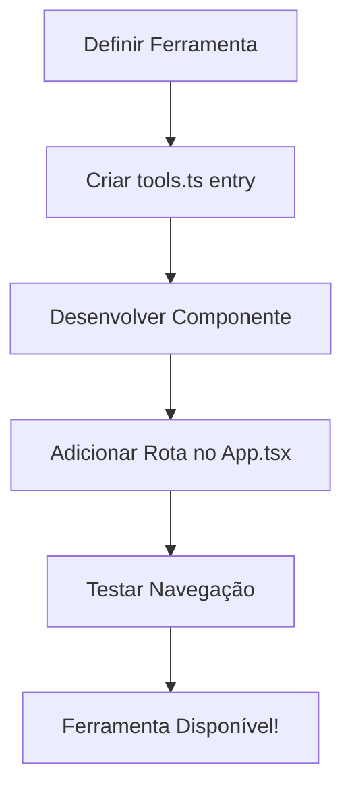

# 🏗️ Arquitetura do Painel Administrativo

## 📐 Visão Geral da Arquitetura

O sistema foi reestruturado para suportar múltiplas ferramentas em uma arquitetura modular e escalável.

```
┌─────────────────────────────────────────────────┐
│           PAINEL ADMINISTRATIVO                  │
│  ┌──────────────────────────────────────┐       │
│  │    AdminLayout (Navegação)           │       │
│  │  - Dashboard                         │       │
│  │  - Ferramentas                       │       │
│  │  - Configurações                     │       │
│  └──────────────────────────────────────┘       │
│                                                  │
│  ┌──────────┐  ┌──────────┐  ┌──────────┐     │
│  │  Tool 1  │  │  Tool 2  │  │  Tool 3  │     │
│  │OrçaRede  │  │  Nova    │  │  Nova    │     │
│  │          │  │Ferramenta│  │Ferramenta│     │
│  └──────────┘  └──────────┘  └──────────┘     │
└─────────────────────────────────────────────────┘
```

## 🗂️ Estrutura de Diretórios

```
src/
├── components/
│   ├── Admin (Painel Administrativo)
│   │   ├── AdminLayout.tsx         # Layout principal
│   │   ├── AdminDashboard.tsx      # Dashboard
│   │   ├── ToolsManagement.tsx     # Gestão de ferramentas
│   │   └── AdminSettings.tsx       # Configurações
│   │
│   ├── OrçaRede (Ferramenta 1)
│   │   ├── Layout.tsx              # Layout do OrçaRede
│   │   ├── Dashboard.tsx           # Dashboard do OrçaRede
│   │   ├── AreaTrabalho.tsx        # Área de trabalho
│   │   └── [outros componentes...] # Componentes específicos
│   │
│   └── [Outras Ferramentas]/       # Suas ferramentas futuras
│
├── contexts/
│   └── AppContext.tsx              # Context do OrçaRede
│
├── types/
│   ├── tools.ts                    # Definições de ferramentas
│   └── index.ts                    # Tipos do OrçaRede
│
└── App.tsx                         # Roteamento principal
```

## 🔄 Fluxo de Navegação

### 1. Entrada do Usuário
```
Usuário acessa → http://localhost:5173
                ↓
        Redireciona para /admin
                ↓
        AdminDashboard é exibido
```

### 2. Acesso a uma Ferramenta
```
Usuário clica em "OrçaRede"
                ↓
        Navega para /tools/orcared
                ↓
        AppProvider é montado
                ↓
        Layout do OrçaRede é exibido
                ↓
        Dashboard do OrçaRede é renderizado
```

### 3. Navegação Interna da Ferramenta
```
Dentro do OrçaRede:
- Dashboard → AreaTrabalho → GerenciarMateriais
  ↑                                       ↓
  └───────── (navegação interna) ────────┘
```

## 🧩 Componentes Principais

### 1. App.tsx (Roteador Principal)
```tsx
<BrowserRouter>
  <Routes>
    {/* Painel Admin */}
    <Route path="/admin" element={<AdminLayout><AdminDashboard /></AdminLayout>} />
    
    {/* Ferramenta OrçaRede */}
    <Route path="/tools/orcared/*" element={
      <AppProvider>
        <OrcaRedeApp />
      </AppProvider>
    } />
    
    {/* Novas Ferramentas */}
    <Route path="/tools/[nova]" element={<NovaFerramenta />} />
  </Routes>
</BrowserRouter>
```

### 2. AdminLayout (Layout do Painel)
- Sidebar com navegação principal
- Menu colapsável
- Responsivo (mobile-first)
- Breadcrumbs automáticos

### 3. Sistema de Ferramentas (tools.ts)
```typescript
interface Tool {
  id: string;           // Identificador único
  name: string;         // Nome exibido
  description: string;  // Descrição
  icon: string;         // Emoji ou ícone
  color: string;        // Gradiente Tailwind
  route: string;        // Rota da ferramenta
  enabled: boolean;     // Status ativo/inativo
  version?: string;     // Versão
  category?: Category;  // Categoria
}
```

## 🔌 Padrões de Integração

### Ferramenta Isolada (Recomendado)
```tsx
// A ferramenta é completamente independente
<Route path="/tools/calculator" element={<Calculator />} />
```

### Ferramenta com Context
```tsx
// A ferramenta tem seu próprio contexto
<Route path="/tools/tasks" element={
  <TaskProvider>
    <TaskManager />
  </TaskProvider>
} />
```

### Ferramenta com Sub-rotas
```tsx
// A ferramenta tem suas próprias rotas internas
<Route path="/tools/crm/*" element={
  <CRMProvider>
    <Routes>
      <Route path="/" element={<CRMDashboard />} />
      <Route path="/contacts" element={<Contacts />} />
      <Route path="/deals" element={<Deals />} />
    </Routes>
  </CRMProvider>
} />
```

## 📦 Isolamento de Ferramentas

Cada ferramenta deve ser:

### ✅ Independente
- Não depende de outras ferramentas
- Tem seu próprio estado (se necessário)
- Pode ser desabilitada sem afetar outras

### ✅ Modular
- Código organizado em sua própria pasta
- Componentes reutilizáveis
- Tipos próprios

### ✅ Configurável
- Aparece no Dashboard principal
- Pode ser ativada/desativada
- Metadados no tools.ts

## 🎨 Sistema de Design

### Cores Padrão
```css
/* Painel Admin */
Primary: Blue-Purple Gradient (from-blue-600 to-purple-600)

/* Categorias */
Finance: Green (from-green-500 to-emerald-700)
Productivity: Blue (from-blue-500 to-blue-700)
Analytics: Purple (from-purple-500 to-purple-700)
Utilities: Orange (from-orange-500 to-red-700)
```

### Componentes Base
- Cards: `bg-white rounded-xl shadow-sm border`
- Botões: `rounded-lg px-4 py-2 font-medium`
- Inputs: `rounded-lg border focus:ring-2`

## 🚀 Fluxo de Adição de Ferramenta



## 🔐 Segurança e Autenticação

### Estado Atual
- Sem autenticação (removida)
- Acesso direto a todas as ferramentas

### Como Adicionar Autenticação

1. **Criar AuthContext**
```tsx
// src/contexts/AuthContext.tsx
export function AuthProvider({ children }) {
  // Lógica de autenticação
}
```

2. **Proteger Rotas**
```tsx
<Route path="/admin/*" element={
  <ProtectedRoute>
    <AdminLayout>...</AdminLayout>
  </ProtectedRoute>
} />
```

3. **Controle por Ferramenta**
```typescript
// tools.ts
{
  id: 'admin-tool',
  requiredRole: 'admin',
  // ...
}
```

## 📊 Performance

### Lazy Loading
```tsx
// Carregamento sob demanda
const Calculator = lazy(() => import('./components/Calculator'));

<Suspense fallback={<Loading />}>
  <Calculator />
</Suspense>
```

### Code Splitting
- Cada ferramenta em seu próprio bundle
- Contextos carregados apenas quando necessário

## 🧪 Testes

### Estrutura Sugerida
```
tests/
├── admin/
│   ├── AdminLayout.test.tsx
│   └── AdminDashboard.test.tsx
├── tools/
│   ├── orcared/
│   └── calculator/
└── integration/
    └── navigation.test.tsx
```

## 📈 Métricas e Monitoramento

### Pontos de Tracking
- Acesso a ferramentas
- Tempo de uso por ferramenta
- Erros e exceções
- Performance de carregamento

### Exemplo de Implementação
```tsx
// hooks/useAnalytics.ts
export function useAnalytics() {
  const trackToolAccess = (toolId: string) => {
    // Implementar tracking
  };
}
```

## 🔄 Atualizações e Manutenção

### Versionamento de Ferramentas
```typescript
{
  id: 'orcared',
  version: '1.0.0', // Seguir Semantic Versioning
}
```

### Changelog
Manter um arquivo `CHANGELOG.md` para cada ferramenta.

## 🎯 Próximos Passos

1. **Adicionar Autenticação** (opcional)
2. **Implementar Temas** (claro/escuro)
3. **Adicionar Notificações** globais
4. **Sistema de Permissões** por ferramenta
5. **Dashboard Personalizável** (drag & drop)
6. **API de Integração** entre ferramentas
7. **PWA Support** (offline-first)
8. **Multi-idioma** (i18n)

---

**Esta arquitetura foi projetada para crescer com suas necessidades!** 🚀
