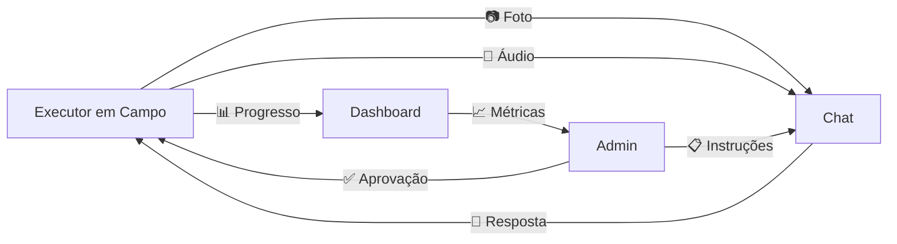

# 🏗️ Módulo de Andamento de Obra e Instalação

## 📋 Visão Geral

O **Módulo de Andamento de Obra** é uma ferramenta de gestão e comunicação em tempo real entre o administrador e os executores em campo. Combina dashboard de progresso, chat multimídia e controle de qualidade.

## 🎯 Objetivo

Centralizar toda a comunicação e acompanhamento de obras de instalação elétrica, permitindo:
- 📊 Monitoramento de progresso em tempo real
- 💬 Comunicação direta com executores
- 📸 Registro visual da execução
- ✅ Controle de qualidade e segurança
- 📝 Rastreabilidade completa

## 🔄 Fluxo de Trabalho

```
1. Orçamento Aprovado (OrçaRede)
   ↓
2. Criar Obra no Sistema
   ↓
3. Atribuir Executor/Equipe
   ↓
4. Executor Atualiza Progresso em Campo
   ↓
5. Admin Acompanha pelo Dashboard
   ↓
6. Comunicação via Chat
   ↓
7. Obra Concluída e Documentada
```

## 📱 Interface Principal (4 Abas)

### 1️⃣ Aba: Progresso

Dashboard completo do andamento da obra.

#### Cards de Resumo
```
┌──────────────┬──────────────┬──────────────┬──────────────┐
│  📊 65%      │  ✅ 130/200  │  📏 3.2km    │  ⏱️ 12 dias  │
│  Progresso   │  Postes      │  Rede        │  P/ Concluir │
└──────────────┴──────────────┴──────────────┴──────────────┘
```

#### Detalhamento

**Instalação de Postes**
```
130 de 200 postes instalados (65%)
├─ Postes 9m:  80/120 ████████░░ 67%
├─ Postes 12m: 50/80  ██████░░░░ 63%
└─ Última atualização: Hoje 14:30
```

**Extensão de Rede**
```
3.2km de 5km instalados (64%)
├─ Cabo primário:   2.8km/4.2km ████████░░ 67%
├─ Cabo secundário: 3.5km/5.8km ██████░░░░ 60%
└─ Última atualização: Hoje 16:15
```

**Materiais Utilizados**
```
58% dos materiais utilizados
├─ Transformadores: 8/15   █████░░░░░ 53%
├─ Isoladores:      580/1000 ██████░░░░ 58%
└─ Conectores:      320/500  ██████░░░░ 64%
```

#### Timeline da Obra
```
✓ 15/01/2026 - Início da Obra
✓ 28/01/2026 - Fundações Concluídas
⏳ Atual      - Instalação em Andamento
○ 25/02/2026 - Previsão de Conclusão
```

---

### 2️⃣ Aba: Chat

Sistema de chat em tempo real com suporte multimídia.

#### Interface do Chat
```
┌─────────────────────────────────────────┐
│  👷 João Silva                 🟢 Online│
├─────────────────────────────────────────┤
│                                         │
│  👷 João Silva              09:15       │
│  ┌──────────────────────────┐          │
│  │ Iniciamos instalação     │          │
│  │ dos postes da Rua B      │          │
│  └──────────────────────────┘          │
│                                         │
│              09:20       👨‍💼 Você (Admin)│
│          ┌──────────────────────────┐  │
│          │ Quantos já instalaram?   │  │
│          └──────────────────────────┘  │
│                                         │
│  👷 João Silva              11:30       │
│  ┌──────────────────────────┐          │
│  │ 8 postes. Foto: 📷       │          │
│  │ ┌──────────────────────┐ │          │
│  │ │  [Imagem Preview]     │ │          │
│  │ └──────────────────────┘ │          │
│  └──────────────────────────┘          │
│                                         │
│  👷 João Silva              14:15       │
│  ┌──────────────────────────┐          │
│  │ 🎤 Áudio (1:23)          │          │
│  │ ▶️ ══════════════ 1:23   │          │
│  └──────────────────────────┘          │
│                                         │
├─────────────────────────────────────────┤
│  📷 🎥 🎤 📍 📎  [Mensagem...] [Enviar]│
└─────────────────────────────────────────┘
```

#### Funcionalidades de Mídia (Ilustradas)

**Botões de Anexo:**
- 📷 **Imagem**: Upload de fotos da obra
- 🎥 **Vídeo**: Vídeos curtos de progresso
- 🎤 **Áudio**: Gravação de áudio direta
- 📍 **Localização**: Compartilhar GPS
- 📎 **Documento**: PDFs, planilhas, etc

**Tipos de Mensagem:**
```typescript
1. Texto simples
2. Imagem com preview
3. Vídeo com thumbnail
4. Áudio com player
5. Localização com mapa
6. Documento com ícone
```

---

### 3️⃣ Aba: Checklist

Sistema de verificação de qualidade e segurança.

#### Categorias de Checklist

**🛡️ Segurança** (100%)
```
✅ EPIs verificados
✅ Área sinalizada
✅ Treinamento de segurança
```

**🔧 Instalação** (50%)
```
✅ Fundações dos postes
☐ Içamento dos postes
☐ Instalação de transformadores
```

**✅ Qualidade** (0%)
```
☐ Verificação de níveis
☐ Testes elétricos
```

**📄 Documentação** (0%)
```
☐ Registro fotográfico
☐ As-built
```

---

### 4️⃣ Aba: Ocorrências

Registro de problemas, dúvidas e alterações.

#### Tipos de Ocorrência
- 🔴 **Problema**: Requer ação imediata
- ❓ **Dúvida**: Necessita esclarecimento
- 🔄 **Alteração**: Mudança no projeto
- ✅ **Conclusão**: Etapa finalizada

#### Status
- 🔴 **Aberta**: Aguardando ação
- 🟡 **Em Análise**: Sendo tratada
- 🟢 **Resolvida**: Concluída

#### Exemplo de Ocorrência
```
┌─────────────────────────────────────────┐
│ 🔴 ALTA                          ABERTA  │
│ Necessário mudar posição de 3 postes    │
│                                         │
│ Encontramos tubulação de água que não  │
│ constava no projeto original.           │
│                                         │
│ Hoje 10:45              [Ver Detalhes →]│
└─────────────────────────────────────────┘
```

---

## 🎨 Design da Interface

### Paleta de Cores
```
Primary: Indigo-Purple (from-indigo-500 to-purple-700)
Sucesso: Green
Alerta: Yellow/Orange
Erro: Red
Neutro: Gray
```

### Layout Responsivo
- Desktop: 3 colunas (progresso + chat)
- Tablet: 2 colunas
- Mobile: 1 coluna com tabs

---

## 💬 Sistema de Chat (Ilustrado)

### Recursos Visuais

#### 1. Mensagens de Texto
```tsx
┌─────────────────────────┐
│ Texto da mensagem aqui  │
│ com quebra de linha     │
└─────────────────────────┘
09:15
```

#### 2. Mensagens com Imagem
```tsx
┌─────────────────────────────┐
│ Foto do poste instalado:    │
│ ┌─────────────────────────┐ │
│ │                         │ │
│ │   [Preview da Imagem]   │ │
│ │                         │ │
│ └─────────────────────────┘ │
└─────────────────────────────┘
11:30
```

#### 3. Mensagens com Áudio
```tsx
┌─────────────────────────────┐
│ 🎤 Explicação do problema   │
│ ▶️ ════════════════ 1:23    │
└─────────────────────────────┘
14:15
```

#### 4. Mensagens com Vídeo
```tsx
┌─────────────────────────────┐
│ 🎥 Vídeo da instalação      │
│ ┌─────────────────────────┐ │
│ │     [Thumbnail]         │ │
│ │         ▶️              │ │
│ └─────────────────────────┘ │
│ Duração: 0:45               │
└─────────────────────────────┘
```

#### 5. Mensagens com Localização
```tsx
┌─────────────────────────────┐
│ 📍 Localização do poste     │
│ ┌─────────────────────────┐ │
│ │    [Mapa Preview]       │ │
│ │    📍 Pin               │ │
│ └─────────────────────────┘ │
│ Lat: -23.5505, Lng: -46.633│
└─────────────────────────────┘
```

---

## 📊 Dashboard de Progresso (Executor)

### Visão do Executor em Campo

```
┌─────────────────────────────────────────┐
│  Meu Progresso - João Silva             │
├─────────────────────────────────────────┤
│  Hoje: 13/02/2026                       │
│                                         │
│  ✅ Atualizar Progresso                 │
│  ┌───────────────────────────────────┐ │
│  │ Postes instalados hoje: [__5__]   │ │
│  │ Metros de rede: [__250__]         │ │
│  │                                   │ │
│  │ [Tirar Foto] [Salvar]            │ │
│  └───────────────────────────────────┘ │
│                                         │
│  📊 Meu Progresso Total:                │
│  ├─ 130 postes (65%)                   │
│  ├─ 3.2km rede (64%)                   │
│  └─ 12 dias restantes                  │
└─────────────────────────────────────────┘
```

---

## 🔐 Perfis de Usuário

### 👨‍💼 Admin (Escritório)
```
Pode:
✅ Ver todas as obras
✅ Acompanhar progresso
✅ Enviar mensagens
✅ Resolver ocorrências
✅ Exportar relatórios
✅ Gerenciar equipe
```

### 👷 Executor (Campo)
```
Pode:
✅ Ver sua obra atual
✅ Atualizar progresso
✅ Enviar fotos/vídeos/áudio
✅ Reportar problemas
✅ Marcar checklist
✅ Consultar projeto
```

---

## 📈 Métricas e KPIs

### Dashboard Admin
```
┌─────────────────────────────────────────┐
│  Visão Geral - Todas as Obras           │
├─────────────────────────────────────────┤
│  5 Obras Ativas                         │
│  ├─ 3 no prazo      ✅                  │
│  ├─ 1 atrasada      ⚠️                  │
│  └─ 1 adiantada     🎉                  │
│                                         │
│  Produtividade Média:                   │
│  ├─ 8.5 postes/dia                     │
│  ├─ 420m rede/dia                      │
│  └─ 92% checklist OK                   │
└─────────────────────────────────────────┘
```

---

## 🎯 Casos de Uso

### Caso 1: Dúvida Técnica em Campo
```
1. Executor encontra problema
2. Tira foto do problema 📷
3. Grava áudio explicando 🎤
4. Envia no chat para Admin
5. Admin responde com solução
6. Executor resolve e confirma ✅
```

### Caso 2: Atualização Diária
```
Fim do dia:
1. Executor abre app
2. Atualiza números:
   - Postes: +12 hoje
   - Rede: +580m hoje
3. Tira foto panorâmica 📷
4. Marca checklist de segurança ✅
5. Admin recebe notificação
```

### Caso 3: Problema Crítico
```
1. Executor: "⚠️ URGENTE"
2. Grava vídeo do problema 🎥
3. Marca como prioridade ALTA
4. Admin vê notificação imediata
5. Abre chat e resolve em tempo real
6. Registra solução na ocorrência
```

### Caso 4: Alteração de Projeto
```
1. Encontrado interferência (tubulação)
2. Executor: Foto + Localização 📍
3. Admin: Analisa alternativa
4. Admin: Envia novo desenho 📎
5. Executor: Implementa mudança
6. Atualiza ocorrência como resolvida
```

---

## 📸 Funcionalidades Multimídia

### Fotos 📷
```
Uso:
├─ Antes/Durante/Depois
├─ Comprovação de execução
├─ Registro de problemas
├─ Documentação as-built
└─ Relatório fotográfico

Preview automático no chat
Galeria organizada por data
Exportação em PDF
```

### Vídeos 🎥
```
Uso:
├─ Explicar problema complexo
├─ Mostrar processo de instalação
├─ Treinamento de equipe
└─ Registro de testes

Limite: 2 minutos
Compressão automática
Thumbnail gerado
```

### Áudios 🎤
```
Uso:
├─ Comunicação rápida
├─ Mãos livres em campo
├─ Explicação detalhada
└─ Registro de reuniões

Gravação direta no app
Player integrado
Transcrição automática (futuro)
```

### Localização 📍
```
Uso:
├─ Marcar poste instalado
├─ Mostrar problema no mapa
├─ Rastrear progresso geográfico
└─ Coordenadas exatas

Mapa interativo
Histórico de localizações
Rota da equipe
```

### Documentos 📎
```
Uso:
├─ Projeto atualizado
├─ Notas fiscais
├─ Certificados de materiais
└─ Relatórios técnicos

PDF, DOCX, XLSX aceitos
Preview de documentos
Download disponível
```

---

## ✅ Sistema de Checklist

### Categorias Padrão

#### 🛡️ Segurança (Obrigatório)
```
□ EPIs completos e em bom estado
□ Área de trabalho sinalizada
□ Treinamento de segurança realizado
□ Kit de primeiros socorros disponível
□ Extintor de incêndio verificado
```

#### 🔧 Instalação
```
□ Fundações verificadas
□ Postes nivelados
□ Cabos tensionados corretamente
□ Conexões testadas
□ Aterramento executado
```

#### ✅ Qualidade
```
□ Alturas verificadas
□ Distâncias respeitadas
□ Testes elétricos OK
□ Inspeção visual aprovada
□ Documentação fotográfica completa
```

#### 📄 Documentação
```
□ As-built atualizado
□ Fotos antes/depois
□ Relatório de testes
□ Certificados de materiais
□ Termo de entrega
```

---

## 🚨 Sistema de Ocorrências

### Níveis de Prioridade

#### 🔴 ALTA
```
- Para a obra imediatamente
- Risco de segurança
- Problema crítico
- Notificação push imediata
```

#### 🟡 MÉDIA
```
- Afeta cronograma
- Necessita decisão
- Dúvida técnica
- Resposta em até 4h
```

#### 🔵 BAIXA
```
- Informativo
- Sugestão
- Documentação
- Sem urgência
```

---

## 📱 App Mobile (Futuro)

### Visão do Executor

```
┌──────────────────────┐
│  🏗️ Minha Obra       │
├──────────────────────┤
│  📊 Dashboard        │
│  ├─ Progresso hoje   │
│  ├─ Checklist        │
│  └─ Pendências       │
│                      │
│  💬 Chat (3)         │
│  📷 Galeria          │
│  📝 Relatório        │
│  ⚙️ Configurações    │
└──────────────────────┘
```

### Funcionalidades Offline
- Salva mensagens localmente
- Envia quando reconectar
- Cache de dados essenciais
- Sincronização automática

---

## 🔗 Integração com OrçaRede

### Fluxo Integrado
```
OrçaRede (Orçamento)
    ↓
Módulo Obra (Criar Obra)
    ↓
Importa:
├─ Lista de materiais
├─ Quantidade de postes
├─ Extensão de rede
├─ Cronograma estimado
└─ Equipe responsável
```

### Benefícios da Integração
- ✅ Não precisa digitar dados novamente
- ✅ Comparação planejado vs executado
- ✅ Atualização automática de custos
- ✅ Rastreabilidade completa

---

## 📊 Relatórios Automáticos

### Relatório Diário
```
📄 Relatório Diário de Obra - 13/02/2026

Progresso:
├─ Postes instalados: +12 (total: 130)
├─ Rede instalada: +580m (total: 3.2km)
└─ Checklist: 85% OK

Ocorrências:
├─ 1 problema resolvido
└─ 2 dúvidas respondidas

Equipe:
└─ João Silva - 8h trabalhadas

Fotos anexadas: 15
Próxima meta: 150 postes até sexta
```

### Relatório Semanal
```
📊 Resumo Semanal (06-13/02)

Produtividade:
├─ Média: 8.7 postes/dia
├─ Melhor dia: 15 postes (terça)
└─ Total semana: 61 postes

Desvios:
├─ 2 dias de chuva
└─ 1 alteração de projeto

Status: No prazo ✅
```

---

## 🎯 Indicadores de Performance

### KPIs Monitorados

**Produtividade**
- Postes/dia
- Metros de rede/dia
- Horas trabalhadas vs produção

**Qualidade**
- % checklist OK
- Retrabalhos
- Testes aprovados

**Prazo**
- Dias no cronograma
- Velocidade atual vs necessária
- Previsão de conclusão

**Segurança**
- Dias sem acidentes
- Checklist de segurança
- Treinamentos realizados

---

## 🚀 Implementação Futura

### Fase 2
- [ ] WebSocket para chat em tempo real
- [ ] Upload real de arquivos (S3/Storage)
- [ ] Player de áudio/vídeo funcional
- [ ] Mapa interativo com pins
- [ ] Notificações push
- [ ] Assinatura digital

### Fase 3
- [ ] App mobile nativo (React Native)
- [ ] Modo offline
- [ ] Reconhecimento de voz
- [ ] IA para análise de imagens
- [ ] Geolocalização em tempo real
- [ ] Dashboard preditivo

### Fase 4
- [ ] Integração com drones
- [ ] Realidade aumentada
- [ ] Blockchain para certificação
- [ ] IoT para sensores
- [ ] Machine Learning para previsões

---

## 🎓 Fluxo de Comunicação



---

## 💡 Benefícios do Módulo

### Para o Admin
- ✅ Visibilidade total da obra
- ✅ Comunicação direta
- ✅ Decisões rápidas
- ✅ Rastreabilidade completa
- ✅ Relatórios automáticos

### Para o Executor
- ✅ Instruções claras
- ✅ Suporte imediato
- ✅ Registro simplificado
- ✅ Autonomia controlada
- ✅ Reconhecimento de produtividade

### Para a Empresa
- ✅ Redução de erros
- ✅ Aumento de produtividade
- ✅ Melhor qualidade
- ✅ Cumprimento de prazos
- ✅ Documentação profissional

---

## 📚 Tecnologias Sugeridas (Implementação)

### Frontend
- React + TypeScript
- Socket.io (real-time)
- React Dropzone (upload)
- Recharts (gráficos)

### Backend (Sugestão)
- Node.js + Express
- PostgreSQL (dados)
- AWS S3 (arquivos)
- WebSocket (chat)
- Redis (cache)

### Mobile (Futuro)
- React Native
- Expo
- AsyncStorage
- Camera API
- Geolocation API

---

**Transforme o acompanhamento de obra em uma experiência profissional e eficiente!** 🏗️📱💬
